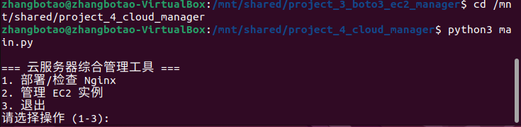
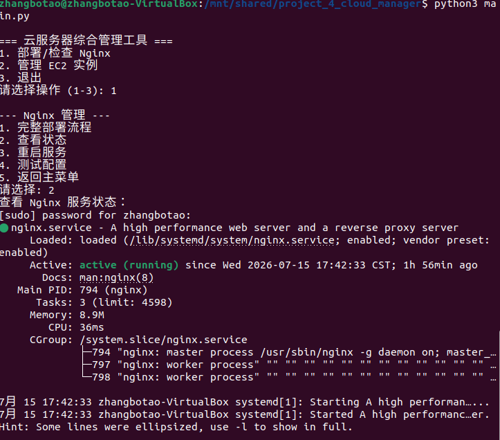
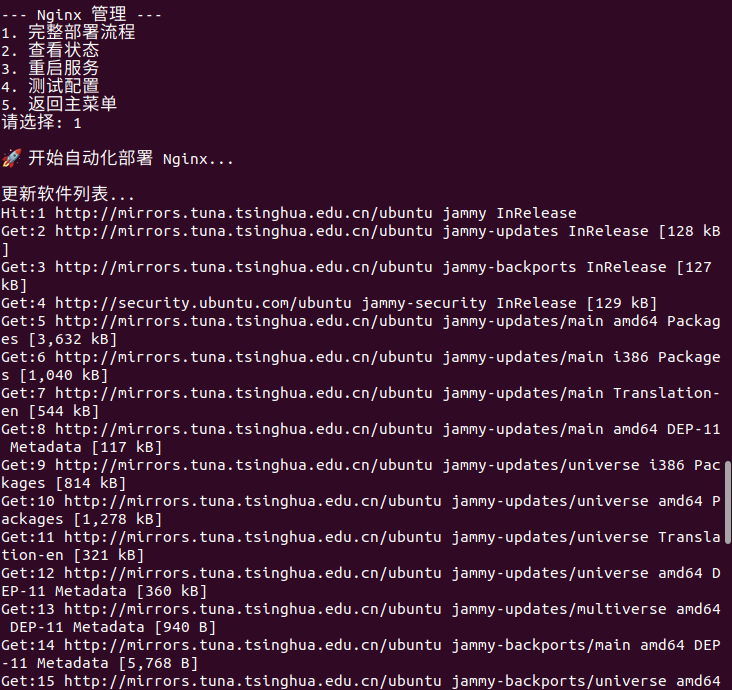
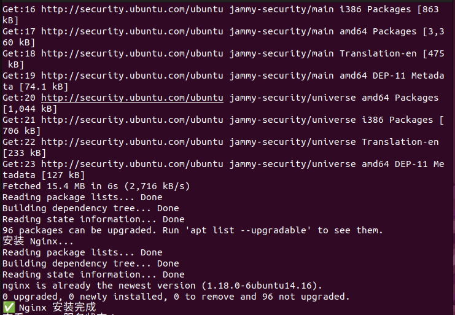
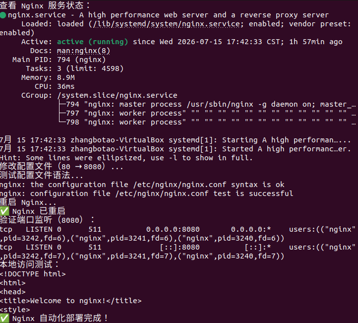
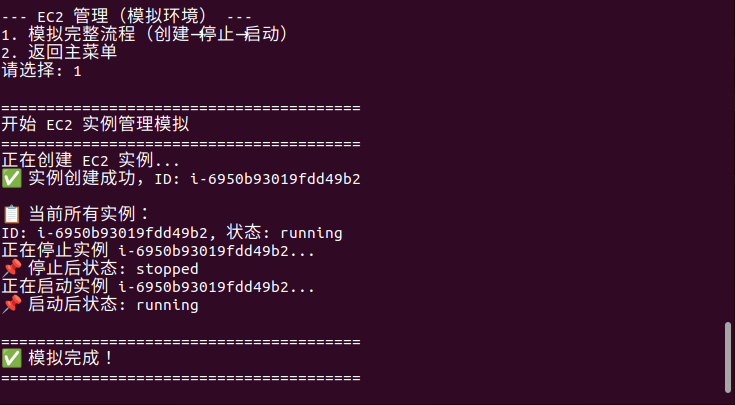

# 项目四：云服务器综合管理工具

> 把 Nginx 自动化部署和 EC2 实例管理整合成一个统一工具

## 项目简介

将 Nginx 自动化部署和 EC2 实例管理整合成一个交互式命令行工具。通过主菜单选择执行 Nginx 管理或 EC2 管理，无需记忆多个命令。

## 技术栈

- **Python 3**
- **Nginx / Ubuntu**
- **Boto3 / Moto**

## 项目结构

```
project4_cloud_manager/
├── README.md
├── main.py                 # 交互式主菜单
├── modules/
│   ├── __init__.py         # 标记 modules 为 Python 包
│   ├── nginx_manager.py    # Nginx 管理模块
│   └── ec2_manager.py      # EC2 管理模块
└── utils/
    └── helpers.py          # 工具函数（预留）
```

## 功能模块

### 1. Nginx 管理
- 完整部署（安装 + 改端口 80→8080 + 验证）
- 查看状态
- 重启服务
- 测试配置语法

### 2. EC2 管理（模拟环境）
- 创建实例
- 列出所有实例
- 停止实例
- 启动实例

## 运行方法

### 1. 安装依赖（首次使用）
```bash
pip3 install boto3 moto
```

### 2. 启动工具
```bash
python3 main.py
```

### 3. 菜单操作
```
=== 云服务器综合管理工具 ===
1. 部署/检查 Nginx
2. 管理 EC2 实例
3. 退出
请选择操作 (1-3):
```

选择 `1` 进入 Nginx 管理，选择 `2` 进入 EC2 管理。

### 4. 直接调用模块（高级用法）
```bash
# Nginx 管理
python3 modules/nginx_manager.py status

# EC2 管理（模拟）
python3 modules/ec2_manager.py mock
```

## 项目截图

### 主菜单界面


### Nginx 服务状态


### Nginx 完整部署




### EC2 模拟管理


## 踩坑记录

- `modules/` 目录下必须有 `__init__.py`（空文件即可），否则 Python 无法识别模块
- `subprocess.run()` 调用模块时需用 `python3` 解释器
- 确保 `boto3` 和 `moto` 已安装：`pip3 install boto3 moto`

## 通过这个项目，我掌握了

-  将多个独立脚本整合成一个统一工具
-  Python 模块化设计（`modules/` 包结构）
-  交互式菜单设计（`main.py`）
-  `subprocess` 调用外部脚本
-  Nginx 自动化部署
-  EC2 实例管理模拟

## 后续计划

支持命令行参数（如 `--nginx-status`）
添加日志记录功能
支持真实 AWS 环境
